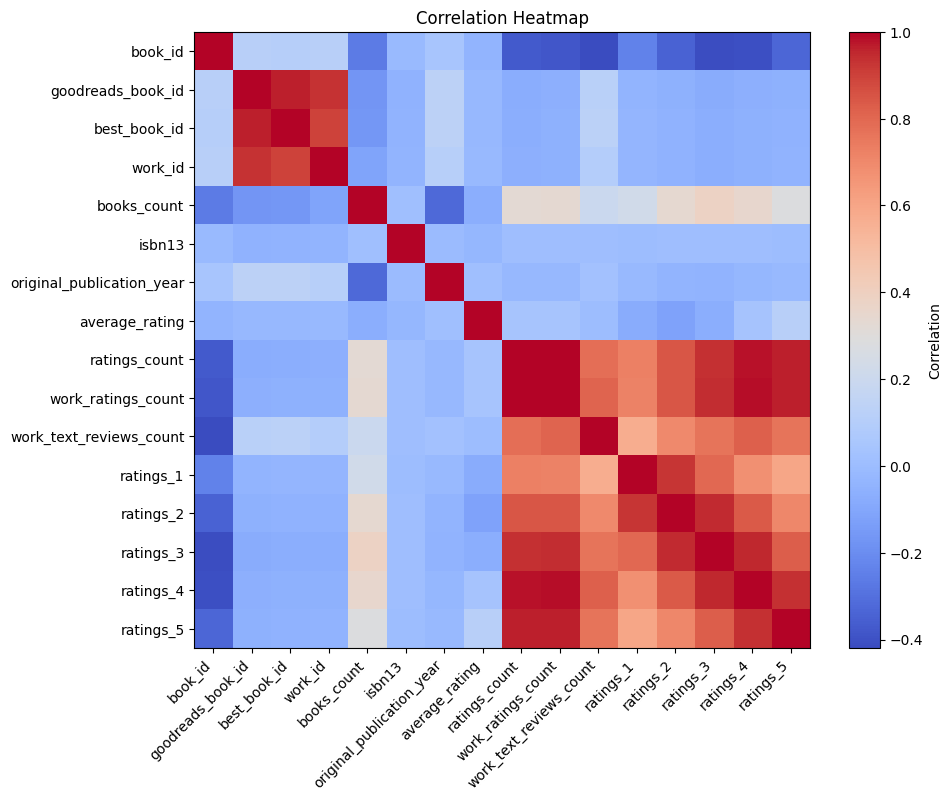
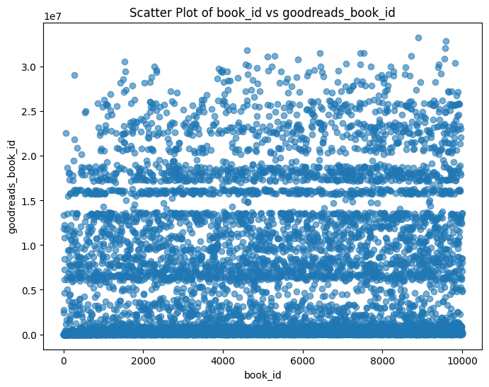

# Analysis of goodreads.csv

## Key Findings
### Summary of Findings and Their Implications

The dataset we analyzed encapsulates rich information on a collection of 10,000 books, providing key insights into various attributes such as authorship, publication years, ratings, and book-specific identifiers from platforms like Goodreads. This summary will outline the critical statistics, correlations, and potential implications of our findings.

#### Key Statistics

1. **Authors and Publication Trends**:
   - The dataset features a wide variety of authors, with a notable frequency of works by Stephen King.
   - The average original publication year is approximately 1982, indicating that many books in the dataset are classic literature, potentially influencing their ratings and reviews due to nostalgia or established cultural value.

2. **Language Distribution**:
   - There are 25 unique language codes, with English being predominant, which suggests that the dataset is largely focused on English-language literature.

3. **Ratings Overview**:
   - The average rating stands at a commendable 4.00 on a 5-point scale, with a clear standard deviation of 0.254, indicating relatively consistent ratings across titles.
   - The dataset shows a significant variation in the number of ratings per book, with some books amassing over 4 million ratings, while others have barely crossed a couple thousand.

4. **Correlations**:
   - The correlation matrix reveals a substantial negative relationship between `books_count` and ratings (both `ratings_count` and `average_rating`). This suggests that books with a higher count of various editions (which can include reprints, annotated versions, etc.) tend to receive lower ratings—possibly due to dilution of the original quality or negative sentiment related to excessive commercialization.
   - Notably, `ratings_count` exhibits a high correlation with the number of ratings across different categories (1 to 5 stars). This indicates that books that engage readers significantly elicit a broader voting experience, resulting in a richer dataset of reviews.

5. **Image Representation**:
   - The dataset includes URLs for images but reveals a duplication rate with the top images being used across several titles (6,669 unique images). This recycling might enhance recognition for certain popular titles but may also decrease novelty for lesser-known works.

#### Implications

The findings suggest several trends and opportunities for potential stakeholders:

- **For Publishers**: Understanding that older titles may be experiencing revival among readers could lead to marketing strategies centered around nostalgia. Publishers could benefit from revamping reprints with new introductions or enhanced covers to attract contemporary audiences.
  
- **For Readers**: This dataset can guide readers who appreciate classics, as high ratings seem to align with older works. Insights about authors who frequently receive high ratings, such as Stephen King, can help casual readers identify books likely to appeal to them based on established preferences.

- **For Researchers**: The analytical correlations provide a framework for exploring consumer behavior in the realm of book purchasing and the influence of ratings on consumer decisions. The observations on how publication frequency may affect overall book sentiment could pave the way for a more nuanced understanding of market dynamics.

- **For Data Analysts**: With the richness of the dataset, there remains an opportunity for further deep dives into specific genres or author trends over time, potentially revealing shifts in public interest or sentiment that can inform future content production for publishing houses.

The visualizations available, such as the heatmap and scatter plot, can further elucidate relationships within the dataset and help present the data to stakeholders in a digestible format.

### Conclusion

In summary, the dataset proves to be a treasure trove of information, offering insights into book ratings, author prevalence, and patterns in readers' engagement. The implications drawn from the data underscore its utility for various audiences, from readers to publishers, and point toward further opportunities for exploration in the world of literature.

## Visualizations

