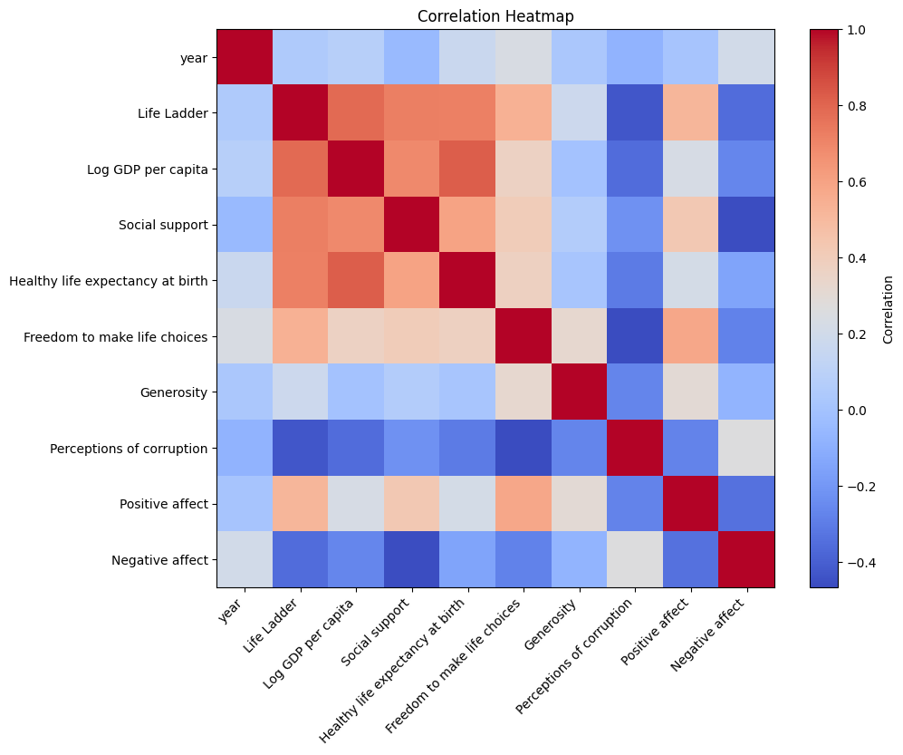
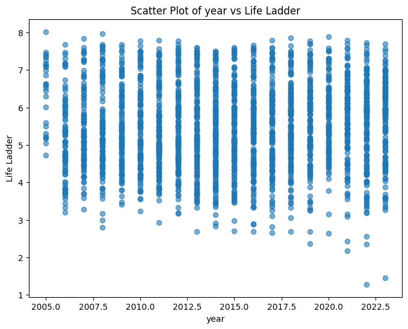

# Analysis of happiness.csv

## Key Findings
Based on the analysis of a dataset focusing on various aspects of well-being across different countries and years, significant insights emerge that demonstrate critical relationships among economic, social, and emotional factors. 

### Overview of the Data 
The dataset contains 2363 entries from 165 countries, spanning the years from 2005 to 2023. Key indicators include measures of life satisfaction (Life Ladder), economic prosperity (Log GDP per capita), social support, health (Healthy life expectancy at birth), freedom, generosity, perceptions of corruption, and emotional well-being (Positive and Negative affect).

### Key Findings

1. **Trends in Life Ladder and Economic Indicators**:
   - The average Life Ladder score across the dataset is approximately 5.48, indicating a moderate level of life satisfaction. 
   - A strong positive correlation (0.78) exists between Life Ladder and Log GDP per capita, suggesting that countries with higher economic wealth tend to report greater life satisfaction. This emphasizes the importance of economic growth in improving individual well-being.

2. **Social Support and Health**:
   - Social support showcased a notable correlation (0.72) with the Life Ladder. Those who report higher social support also tend to experience increased levels of life satisfaction. 
   - Similar correlations are observed between Healthy life expectancy and Life Ladder (0.71), indicating that better health outcomes contribute positively to the overall happiness of individuals.

3. **Freedom and Well-being**:
   - The metric "Freedom to make life choices" also correlated strongly with Life Ladder (0.54). This suggests that individuals in nations where personal freedoms are prioritized report higher satisfaction levels, highlighting the role of personal agency in well-being.

4. **Positive vs. Negative Affect**:
   - Positive affect had a significant positive relationship with Life Ladder (0.51), while negative affect was inversely related (-0.35). This highlights that emotional positivity directly impacts life satisfaction, whereas negative emotions detract from it.

5. **Corruption and Life Satisfaction**:
   - The perception of corruption was found to negatively correlate with life satisfaction significantly (-0.43). This suggests that individuals in countries with high levels of perceived corruption are likely to report lower life satisfaction, reflecting a distrust in governance and societal fairness.

### Missing Data Considerations
While the dataset is comprehensive, there are notable missing values, particularly in Healthy life expectancy (63 missing), which could potentially skew some analysis. This missingness should be addressed in further studies to enhance the accuracy of insights drawn.

### Implications and Conclusions
The findings underscore the interconnectedness of economic stability, social support, health, freedom, and perceptions of corruption in shaping life satisfaction. Policymakers should consider these relationships when designing social welfare programs and economic policies, as improving social support networks, reducing corruption, and enabling personal freedoms can create a holistic approach to enhance national well-being.

Furthermore, this study highlights the importance of addressing mental well-being and emotional health as part of broader national health strategies, emphasizing that happiness is not solely determined by economic factors but also by social justice, freedom, and emotional resilience.

### Visual Representation
Charts like the happiness heatmap and scatter plot effectively visualize these insights, showing the relationships between different variables and providing a clearer understanding of the underlying trends in the data.

In summary, the integration of economic, social, and emotional measures provides a robust framework for evaluating well-being. Continued research in this area is imperative for understanding the dynamics of happiness in a rapidly changing global landscape.

## Visualizations

