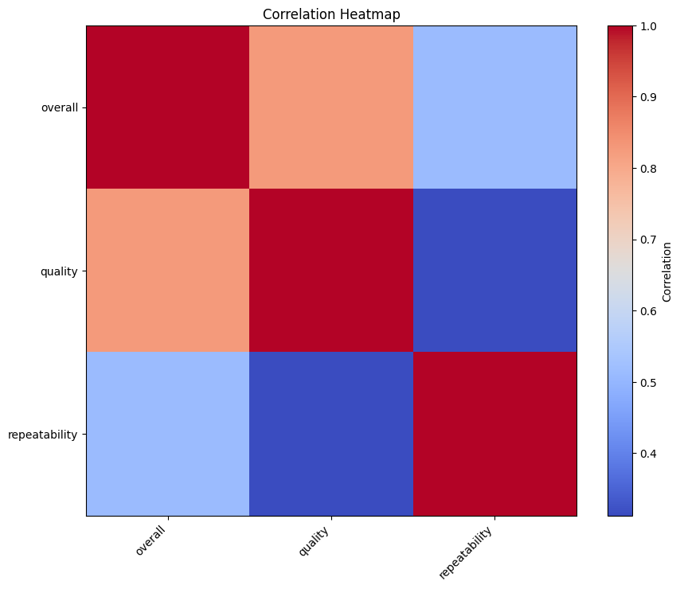
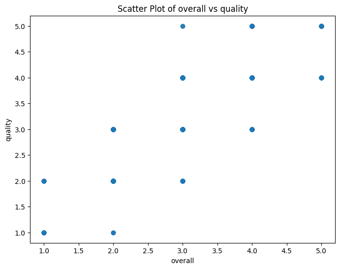

# Analysis of media.csv

## Key Findings
### Dataset Overview and Key Findings

The dataset under review contains a total of 2,652 entries with various attributes related to media ratings, encapsulated in the columns: ['date', 'language', 'type', 'title', 'by', 'overall', 'quality', 'repeatability']. These columns provide insights into not only the media contents but also their reception through quality assessment and repeatability ratings by viewers.

#### Key Statistics:

1. **Date of Media Entries**:
   - The dataset spans a wide range of dates with a total of **2,055 unique dates**. The most frequently recorded date is **21-May-06**, appearing **8 times**. 
   - However, we note that **99 entries are missing date information**, which could potentially affect trend analysis over time.

2. **Language and Type**:
   - The most prevalent language observed in the dataset is **English**, dominating with **1,306 entries** out of the **11 unique languages**. This suggests a significant preference or accessibility of English media among the audience.
   - The most common type recorded is **movies**, with **2,211 entries**, indicating a strong inclination towards film media in this dataset.

3. **Media Titles and Creators**:
   - There are **2,312 unique titles**, with **'Kanda Naal Mudhal'** being the title with the highest frequency at **9 occurrences**.
   - The leading contributor or creator is **Kiefer Sutherland**, with **48 mentions**, indicating his recognized presence within the media landscape covered by this dataset.

#### Ratings Analysis:

The dataset also includes three key performance indicators—**overall ratings**, **quality**, and **repeatability**—with the following insights:

- **Overall Ratings**:
  - The average overall rating is approximately **3.05**, with most ratings clustering around **3.0**, visible by the 25th and 50th percentiles. The minimum rating is **1.0** and the maximum is **5.0**, providing a balanced view of viewer satisfaction.
  
- **Quality Ratings**:
  - The average quality rating is slightly higher at **3.21**, showing a degree of optimism or appreciation in quality perception among viewers when compared with the overall ratings.

- **Repeatability**:
  - Average repeatability is rated at approximately **1.49**, revealing that viewers may not necessarily choose to revisit the same media repeatedly.

### Correlation and Insights:

The correlation matrix indicates the following relationships:

- There's a strong positive correlation (r = 0.83) between **overall ratings** and **quality** ratings, suggesting that as the quality perception improves, so does the overall viewer satisfaction. This warrants further exploration into what factors contribute to perceived quality.
  
- A moderate correlation exists between **overall ratings** and **repeatability** (r = 0.51), indicating that higher-rated media may have a higher chance of being revisited by viewers, though it is not a strong relationship.

- Quality has a much weaker correlation with repeatability (r = 0.31), suggesting that even high-quality content may not always encourage viewers to re-watch it.

### Implications and Recommendations:

1. **Focus on Quality**: The strong correlation between quality and overall ratings accentuates the need for creators to invest in producing high-quality content. This focus should not just be on storytelling but also on production values to appeal to viewers' standards.

2. **Investigate Genre Preferences**: Given the dominance of movies, it could be fruitful to analyze specific genres that are receiving both high-quality ratings and repeat visits to understand viewer loyalty and preferences.

3. **Address Missing Dates**: The presence of missing dates may hinder a comprehensive time-based analysis of viewership trends. Efforts should be made to fill in these gaps, perhaps by correlating with other datasets, to get a clearer picture of media consumption patterns over time.

4. **Utilize Visual Data**: Utilizing available charts such as the heatmap and scatter plot can provide additional visual insights into the relationships between ratings and factors, helping in deeper analysis. 

In conclusion, while the dataset brings forth a wealth of insights and potential questions, it also highlights the importance of data completeness and quality metrics as pivotal in influencing viewer satisfaction and engagement in the media landscape.

## Visualizations

